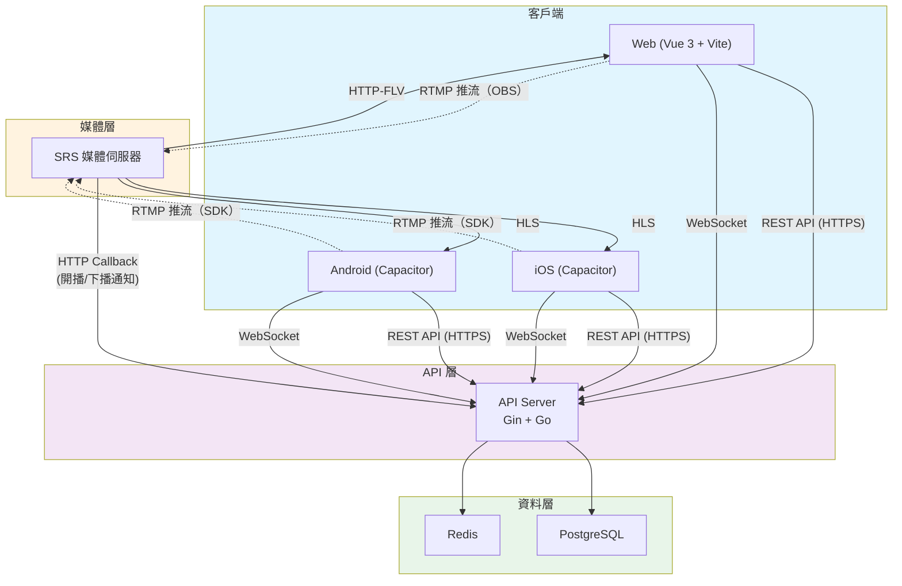
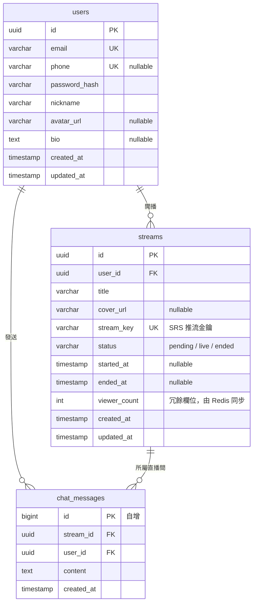

# 系統架構設計 - Streams Demo（類抖音直播 App）

**角色**：SA（系統架構師）
**日期**：2026-04-01
**版本**：v0.1（MVP）

---

## 1. 技術棧選擇

### 1.1 前端跨平台方案：Capacitor + Vue 3 + Vite

**選擇**：`@capacitor/core` + `Vue 3 (Composition API)` + `Vite`

**理由**：
- Capacitor 是 Vue 生態中最成熟的跨平台方案，由 Ionic 團隊維護，社群活躍
- 以 Web 為核心，原生功能透過 Plugin 橋接，Web/iOS/Android 共用同一份 Vue 程式碼
- 相較於 Ionic Components，Capacitor 不綁定 UI 框架，可自由選擇 UI 庫（本案使用 Vant 4，專為行動端設計）
- 直播場景需要的相機/麥克風存取，Capacitor 有官方 Plugin 支援

**替代方案比較**：

| 方案 | 優點 | 缺點 | 不選原因 |
|------|------|------|----------|
| **Ionic + Vue** | UI 元件豐富 | Ionic 元件風格偏 Material/iOS 原生，客製化成本高 | 抖音風格的全螢幕沉浸式 UI 需高度客製，Ionic 元件反而是負擔 |
| **uni-app** | 中國生態好、多端支援 | 框架約束多、Vue 3 支援有歷史包袱、社群偏封閉 | 技術債風險高，國際化社群支援弱 |
| **Quasar** | 全家桶方案 | 學習曲線陡、綁定較深 | 專案不需要桌面端，Quasar 太重 |
| **NativeScript-Vue** | 真原生渲染 | 社群萎縮、Vue 3 支援不穩定 | 維護風險太高 |

**UI 庫選擇**：Vant 4
- 專為行動端設計的 Vue 3 元件庫
- 輕量、可按需引入、支援深色模式
- 抖音風格的全螢幕 UI 需大量客製，Vant 提供基礎元件即足夠

---

### 1.2 後端框架：Gin

**選擇**：`Gin`

**理由**：
- Go 生態中效能最佳、使用最廣的 HTTP 框架
- 路由效能優秀（基於 radix tree）
- 中間件生態豐富（JWT、CORS、Rate Limit 等現成方案）
- 學習曲線平緩，開發速度快，適合 MVP 階段

**替代方案比較**：

| 方案 | 優點 | 缺點 | 不選原因 |
|------|------|------|----------|
| **Echo** | API 設計優雅 | 社群規模略小於 Gin | 兩者差異不大，Gin 生態更成熟 |
| **Fiber** | 效能極高（基於 fasthttp） | 不相容 net/http 標準庫 | 直播場景需要 WebSocket，fasthttp 的 WebSocket 支援有限 |
| **Go-Zero** | 微服務全家桶 | 太重、學習曲線高 | MVP 階段不需要微服務框架 |
| **標準庫 net/http** | 零依賴 | 路由功能簡陋 | 開發效率不足 |

---

### 1.3 直播串流：SRS + RTMP 推流 / HTTP-FLV 拉流（Web）+ HLS 拉流（備援）

這是本專案技術決策的核心，以下詳細分析。

#### 串流協議分析

| 協議 | 延遲 | 瀏覽器支援 | 推流端支援 | 適合場景 |
|------|------|------------|------------|----------|
| **RTMP** | 1-3 秒 | 不支援（Flash 已死） | OBS、FFmpeg、行動端 SDK 均支援 | 推流標準 |
| **HTTP-FLV** | 1-3 秒 | 需 JS 解碼（flv.js/mpegts.js） | 不適合推流 | Web 低延遲拉流 |
| **HLS** | 5-30 秒 | 原生支援 | 不適合推流 | 行動端拉流、CDN 分發 |
| **WebRTC** | < 500ms | 原生支援 | 原生支援 | 超低延遲互動 |
| **SRT** | 1-3 秒 | 不支援 | 專業場景 | 不穩定網路下的推流 |

#### 架構決策

```
推流端 ──RTMP──→ SRS 媒體伺服器 ──┬── HTTP-FLV ──→ Web 觀眾（低延遲）
                                   ├── HLS ──→ 行動端觀眾（相容性好）
                                   └── WebRTC ──→ 未來互動場景（Phase 2）
```

**為什麼選 SRS 而非其他媒體伺服器**：

| 方案 | 優點 | 缺點 | 不選原因 |
|------|------|------|----------|
| **SRS (Simple Realtime Server)** | 高效能 C++ 實作、支援 RTMP/HLS/HTTP-FLV/WebRTC、Docker 部署簡單、中文文件完善 | — | ✅ 選擇此方案 |
| **Nginx-RTMP** | 穩定、與 Nginx 整合 | 功能單一、只支援 RTMP+HLS、不支援 HTTP-FLV、已停止積極維護 | 功能不足 |
| **LiveKit** | WebRTC 原生、互動能力強 | 架構複雜、資源消耗大、RTMP 推流需額外轉換 | MVP 階段太重，WebRTC 全鏈路對推流端要求高 |
| **Janus** | WebRTC 閘道器、靈活 | C 語言、運維複雜 | 團隊維護成本高 |
| **MediaSoup** | Node.js 生態、SFU 架構 | 不支援 RTMP 推流 | 不適合傳統直播場景 |

**MVP 階段策略**：
- 推流：RTMP（最成熟、SDK 支援最廣）
- Web 拉流：HTTP-FLV via mpegts.js（延遲 1-3 秒，體驗接近即時）
- 行動端拉流：HLS（iOS/Android 原生支援，Capacitor 可直接使用 `<video>` 標籤）
- WebRTC 留待 Phase 2（連麥、PK 等互動場景）

**推流 SDK（行動端）**：使用 Capacitor Plugin 封裝 RTMP 推流
- iOS：`LFLiveKit` 或 `HaishinKit`
- Android：`yasea` 或 `rtmp-rtsp-stream-client-java`
- MVP 階段可先僅支援 Web 端用 OBS 推流，降低開發成本

---

### 1.4 即時通訊（彈幕）：WebSocket（Gorilla → nhooyr/websocket）

**選擇**：`nhooyr.io/websocket`

**理由**：
- 彈幕是「一對多廣播」場景，WebSocket 是最直接的方案
- `nhooyr.io/websocket` 是目前 Go 生態中維護最積極的 WebSocket 庫
- 支援 context 取消、併發安全的寫入、壓縮
- Gorilla/websocket 已於 2022 年宣布歸檔（雖然後來恢復維護，但 nhooyr 設計更現代）

**架構設計**：
- 每個直播間一個 Room，Room 內維護觀眾連線 Map
- 訊息透過 Go channel 廣播到同 Room 的所有連線
- MVP 階段單機即可支撐（估計單機 10K+ 連線無壓力）

**替代方案**：

| 方案 | 不選原因 |
|------|----------|
| **SSE (Server-Sent Events)** | 單向通訊，彈幕需要雙向（觀眾也要發訊息） |
| **Socket.IO** | Go 生態的 Socket.IO 實作不成熟 |
| **MQTT** | 太重，適合 IoT，不適合彈幕 |
| **Redis Pub/Sub + WebSocket** | MVP 單機不需要，但 Scale 時會引入（見下方） |

**未來擴展**：當單機不夠時，引入 Redis Pub/Sub 做跨節點廣播。

---

### 1.5 資料庫：PostgreSQL

**選擇**：`PostgreSQL 16`

**理由**：
- 功能完整（JSON、全文搜尋、Window Functions 等），減少外部依賴
- Go 生態有優秀的驅動：`pgx`（效能最佳）+ `sqlc`（型別安全的 SQL 生成）
- 直播平台的資料模型（用戶、直播間、聊天記錄）是典型關聯式結構
- 免費、開源、社群龐大

**替代方案**：

| 方案 | 不選原因 |
|------|----------|
| **MySQL** | 功能不如 PostgreSQL 豐富，JSON 支援較弱 |
| **MongoDB** | 直播平台資料有明確關聯，NoSQL 反而增加複雜度 |
| **SQLite** | 不適合多連線的線上服務 |

**ORM / Query Builder 選擇**：`sqlc`
- 從 SQL 生成型別安全的 Go 程式碼，零執行期反射
- 比 GORM 效能好、比原生 SQL 安全
- 適合團隊協作（SQL 就是文件）

---

### 1.6 快取：Redis

**選擇**：`Redis 7`

**理由（MVP 即需要）**：
- **直播間線上人數**：高頻讀寫，用 Redis INCR/DECR
- **直播列表快取**：大廳頁面是高頻訪問，用 Redis 快取避免每次查 DB
- **用戶 Session / Token 黑名單**：JWT 搭配 Redis 做 Token 撤銷
- **未來彈幕跨節點廣播**：Redis Pub/Sub

**MVP 階段不引入訊息佇列**：
- Kafka/RabbitMQ/NATS 在 MVP 階段是過度設計
- 直播開播/下播等事件用 Redis Pub/Sub 即可處理
- 當規模成長需要事件驅動架構時再引入 NATS（輕量、Go 原生）

---

## 2. 系統架構圖



### 架構說明

- **API Server** 是核心，處理所有業務邏輯（用戶、直播間管理、彈幕）
- **SRS** 獨立負責媒體串流，透過 HTTP Callback 與 API Server 溝通
  - 主播開播時：SRS 收到 RTMP 推流 → 回調通知 API Server → API 更新直播狀態
  - 主播下播時：同理，SRS 回調通知 API Server
- **Redis** 處理高頻讀寫（線上人數、直播列表快取、彈幕廣播）
- **PostgreSQL** 儲存持久化資料（用戶、直播間、聊天記錄）

---

## 3. API 設計概要

Base URL: `/api/v1`

### 3.1 認證模組

| Method | Endpoint | 說明 |
|--------|----------|------|
| POST | `/auth/register` | 用戶註冊（手機號/Email + 密碼） |
| POST | `/auth/login` | 用戶登入，回傳 JWT access_token + refresh_token |
| POST | `/auth/refresh` | 刷新 access_token |
| POST | `/auth/logout` | 登出（將 token 加入黑名單） |

### 3.2 用戶模組

| Method | Endpoint | 說明 |
|--------|----------|------|
| GET | `/users/me` | 取得目前用戶資訊 |
| PUT | `/users/me` | 更新個人資料（暱稱、頭像等） |
| GET | `/users/:id` | 取得指定用戶公開資訊 |

### 3.3 直播模組

| Method | Endpoint | 說明 |
|--------|----------|------|
| GET | `/streams` | 直播列表（大廳），支援分頁、排序 |
| POST | `/streams` | 建立直播間（取得推流地址） |
| GET | `/streams/:id` | 取得直播間詳情（含拉流地址） |
| PUT | `/streams/:id` | 更新直播間資訊（標題、封面） |
| DELETE | `/streams/:id` | 結束直播 |
| GET | `/streams/:id/viewers` | 取得觀看人數 |

### 3.4 SRS 回調（內部）

| Method | Endpoint | 說明 |
|--------|----------|------|
| POST | `/internal/srs/on_publish` | SRS 回調：有人開始推流 |
| POST | `/internal/srs/on_unpublish` | SRS 回調：推流結束 |
| POST | `/internal/srs/on_play` | SRS 回調：有人開始拉流 |
| POST | `/internal/srs/on_stop` | SRS 回調：拉流結束 |

### 3.5 彈幕（WebSocket）

| 連線 | 說明 |
|------|------|
| `ws://.../ws/chat/:stream_id` | 加入直播間聊天室 |

**WebSocket 訊息格式（JSON）**：

```json
// 客戶端 → 伺服器（發送彈幕）
{
  "type": "chat",
  "content": "666666"
}

// 伺服器 → 客戶端（廣播彈幕）
{
  "type": "chat",
  "user_id": "xxx",
  "nickname": "小明",
  "content": "666666",
  "timestamp": 1711929600
}

// 伺服器 → 客戶端（系統訊息）
{
  "type": "system",
  "content": "小明 進入直播間",
  "viewer_count": 1234
}
```

### 3.6 認證機制

- JWT（access_token 有效期 15 分鐘，refresh_token 有效期 7 天）
- access_token 放 `Authorization: Bearer <token>` Header
- 所有 `/api/v1/*` 端點（除 auth 以外）需要認證
- SRS 回調端點用 Secret Token 驗證（不走 JWT）

---

## 4. DB Schema 概要



### Schema 設計說明

- **users**：基本用戶表，email 為必填唯一值，phone 為選填
- **streams**：直播間表，`stream_key` 是推流時的驗證金鑰（由 API 生成，傳給 SRS 驗證）
- **chat_messages**：彈幕訊息持久化。MVP 階段先全量儲存，後續可改為只存近 N 天
- **viewer_count** 放在 streams 表是冗餘設計，實際即時數據在 Redis，定期同步回 DB

### 索引規劃

| 表 | 索引 | 用途 |
|----|------|------|
| `streams` | `(status, created_at DESC)` | 大廳列表查詢（只顯示 live 狀態，按時間排序） |
| `streams` | `(user_id, created_at DESC)` | 查詢某用戶的直播歷史 |
| `streams` | `(stream_key)` UNIQUE | SRS 回調時驗證推流合法性 |
| `chat_messages` | `(stream_id, created_at)` | 查詢某直播間的歷史彈幕 |

---

## 5. 技術風險與建議

### 風險 1：行動端推流品質與相容性

**風險等級**：🔴 高

**說明**：行動端 RTMP 推流需要原生 SDK 支援（相機擷取、硬體編碼、RTMP 封裝）。Capacitor 沒有現成的直播推流 Plugin。

**建議**：
- MVP 階段推流功能先支援 Web（用 OBS 或 WebRTC 轉 RTMP），觀看功能全平台支援
- 行動端推流作為 Phase 2，屆時開發 Capacitor Custom Plugin 封裝原生 SDK
- 這樣可以大幅降低 MVP 開發時間，同時驗證核心商業邏輯

### 風險 2：HTTP-FLV 在 iOS Safari 的支援

**風險等級**：🟡 中

**說明**：mpegts.js（HTTP-FLV 播放器）依賴 MediaSource Extensions (MSE)，iOS Safari 對 MSE 的支援有限制（僅 iPad 17.1+ 支援 Managed MSE）。

**建議**：
- iOS 裝置統一使用 HLS 拉流（原生支援，零相容性問題）
- Web 端根據 User-Agent 判斷：桌面/Android 用 HTTP-FLV（低延遲），iOS 用 HLS
- 這是業界標準做法（B 站、抖音 Web 版也是如此）

### 風險 3：WebSocket 彈幕單機瓶頸

**風險等級**：🟢 低（MVP 階段）

**說明**：單機 Go WebSocket 可輕鬆處理 10K-50K 連線，MVP 階段足夠。但如果某個直播間爆紅（百萬觀眾），單機會成為瓶頸。

**建議**：
- MVP 階段：單機，不做額外處理
- Scale 階段：引入 Redis Pub/Sub 做跨節點廣播，多台 WebSocket Server 負載均衡
- 同時考慮彈幕限流（例如每秒最多顯示 50 條、合併重複內容）

### 風險 4：SRS 與業務系統的整合

**風險等級**：🟡 中

**說明**：SRS 透過 HTTP Callback 通知業務系統，但 Callback 可能失敗（網路問題、API Server 重啟等），導致直播狀態不一致。

**建議**：
- 實作定時同步任務：每分鐘從 SRS API 查詢活躍串流，與 DB 狀態比對修正
- SRS Callback 加上重試機制（SRS 內建支援）
- 監控 SRS 與 API Server 之間的回調成功率

### 風險 5：JWT Token 安全

**風險等級**：🟡 中

**說明**：JWT 一旦簽發無法撤銷（除非用黑名單機制），若 Token 外洩，攻擊者可冒充用戶。

**建議**：
- access_token 短效期（15 分鐘）
- refresh_token 存 Redis，支援主動撤銷
- 登出時將 access_token 加入 Redis 黑名單（TTL = token 剩餘有效期）
- 敏感操作（開播）額外驗證

---

## 6. MVP 目錄結構建議

```
streams-demo/
├── frontend/                 # Vue 3 + Capacitor
│   ├── src/
│   │   ├── views/            # 頁面元件
│   │   ├── components/       # 共用元件
│   │   ├── composables/      # Vue Composables
│   │   ├── services/         # API 呼叫層
│   │   ├── stores/           # Pinia 狀態管理
│   │   ├── router/           # Vue Router
│   │   └── utils/            # 工具函式
│   ├── android/              # Capacitor Android
│   ├── ios/                  # Capacitor iOS
│   └── package.json
│
├── backend/                  # Go API Server
│   ├── cmd/
│   │   └── server/           # 程式進入點
│   ├── internal/
│   │   ├── handler/          # HTTP Handler（Controller）
│   │   ├── service/          # 業務邏輯層
│   │   ├── repository/       # 資料存取層
│   │   ├── model/            # 資料模型
│   │   ├── middleware/       # 中間件（JWT、CORS 等）
│   │   └── ws/               # WebSocket 彈幕管理
│   ├── db/
│   │   ├── migrations/       # SQL Migration 檔案
│   │   └── queries/          # sqlc SQL 查詢
│   ├── config/               # 設定檔
│   └── go.mod
│
├── deploy/                   # 部署相關
│   ├── docker-compose.yml    # 本地開發環境（SRS + PostgreSQL + Redis）
│   └── srs/
│       └── srs.conf          # SRS 設定檔
│
└── .ai-team/                 # AI 團隊文件
    └── plans/
        └── architecture.md   # 本文件
```

---

## 7. 技術棧總覽

| 層級 | 技術 | 版本 |
|------|------|------|
| 前端框架 | Vue 3 (Composition API) | 3.5+ |
| 建構工具 | Vite | 6+ |
| 跨平台 | Capacitor | 6+ |
| UI 元件庫 | Vant 4 | 4.x |
| 狀態管理 | Pinia | 2.x |
| 路由 | Vue Router | 4.x |
| 後端框架 | Gin | 1.10+ |
| WebSocket | nhooyr.io/websocket | 1.8+ |
| DB Driver | pgx | 5.x |
| SQL 生成 | sqlc | 1.x |
| 資料庫 | PostgreSQL | 16 |
| 快取 | Redis | 7 |
| 媒體伺服器 | SRS | 6 |
| 容器化 | Docker + Docker Compose | — |
